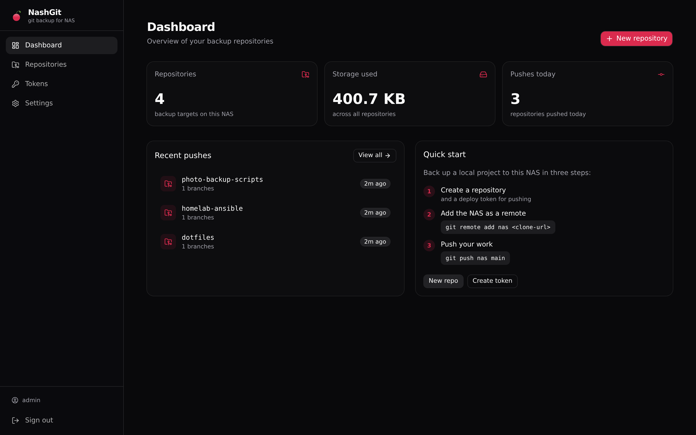
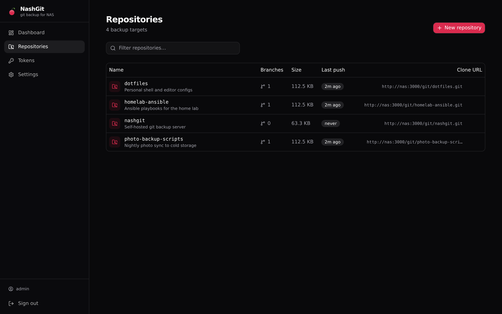
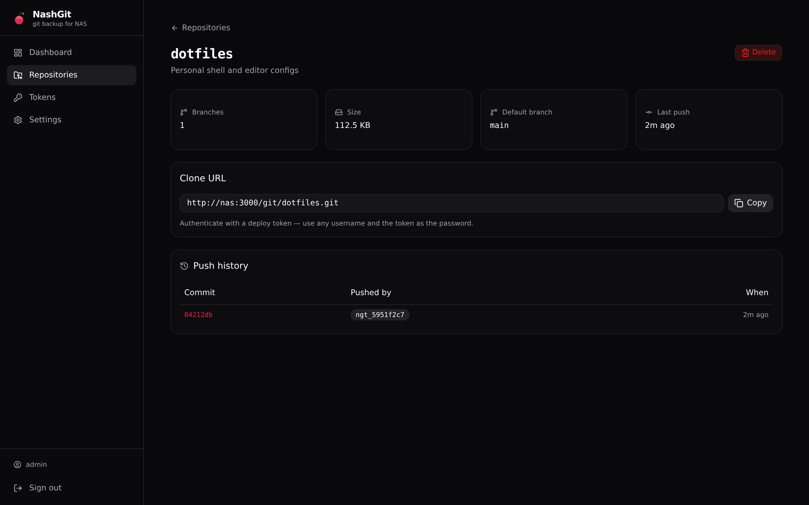
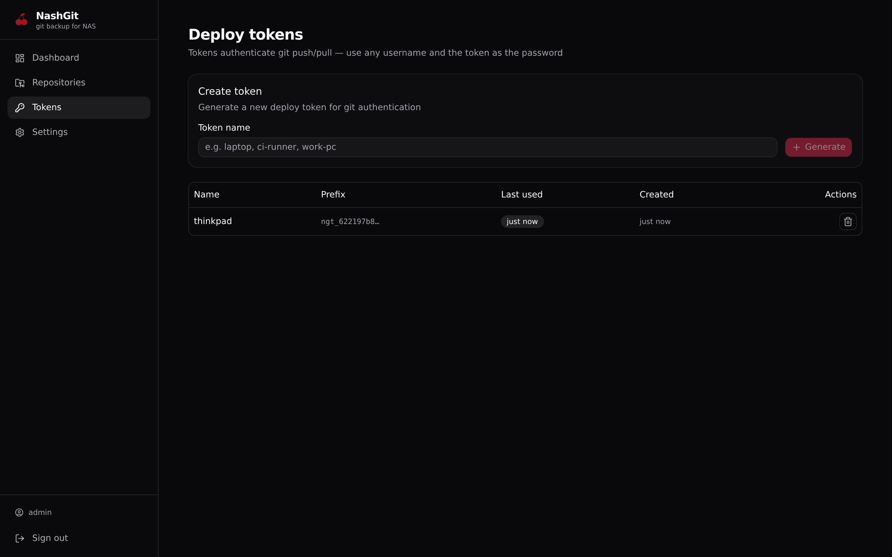
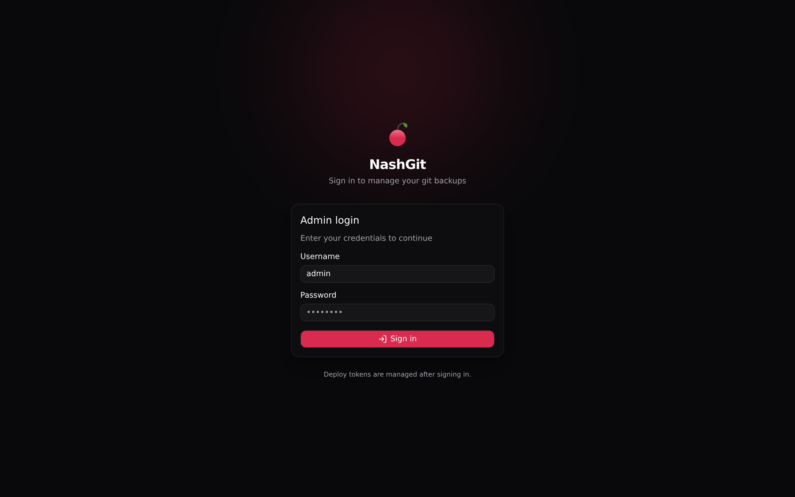

<div align="center">


# NashGit

### Self-hosted git backup for your NAS. Push your work to hardware you own.

NashGit turns any NAS, home server, or always-on machine into a private git remote.
Create a repository and a deploy token from the web UI, then `git push`. Your code
stays on your network, on your storage, under your control.

<br/>


[](LICENSE)
[](https://github.com/ShAInyXYZ/NashGit/actions/workflows/ci.yml)

<br/>

**[What It Is](#what-it-is)** · **[Features](#features)** · **[Quick Start](#quick-start)** · **[Back Up a Project](#back-up-a-project)** · **[Remote Access](#remote-access)** · **[Security](#security)** · **[Architecture](#architecture)** · **[CLI](#the-nash-cli)** · **[AI Agents](#using-nashgit-with-ai-agents)** · **[Development](#development)** · **[License](#license)**

</div>

---

## What It Is

**NashGit is a tiny, self-hosted git remote for personal backups.**

It is not GitHub. It is not a forge, a CI system, or a collaboration platform. It is one
thing done simply: a place you push your local repositories to, so they live on a machine
you control. Run it in Docker on your NAS, open the web UI once to create a repo and token,
and use plain `git` commands from every machine you work on.

The whole app ships as a **single container** with one port. No database to wire up, no
reverse proxy required to start, and no monthly subscription. Your bare repositories and
their metadata live in a single `./data` directory that you can back up, snapshot, or sync
like any other folder.

<div align="center">
<br/>

</div>

---

## Features

- **Push-only git remote** — clone, push, and pull over HTTP smart-transport.
- **Deploy tokens** — revocable, bcrypt-hashed secrets used as the git password.
- **Backup integrity checks** — one-click `git fsck` verification per repo, with a
  Healthy/Issues status on the dashboard. A backup you haven't verified isn't a backup.
- **Freshness cherries** — each repo shows how alive its backup is at a glance:
  fresh, ripe, getting stale, or withered.
- **Single-container deployment** — API, git transport, and web UI all on port `3000`.
- **SvelteKit + shadcn-svelte UI** — dark by default, with a cherry accent.
- **SQLite metadata** — repository list, token registry, and push history in one file.
- **Lightweight** — Node 20+, Express, and the system `git http-backend` for robust transport.

---

## Screenshots

<div align="center">

 

 

</div>

---

## Quick Start

The recommended way to run NashGit is with Docker Compose and the prebuilt image.

```bash
# 1. Grab the compose file + env template (no need to clone the whole repo)
curl -O https://raw.githubusercontent.com/ShAInyXYZ/NashGit/main/docker-compose.yml
curl -O https://raw.githubusercontent.com/ShAInyXYZ/NashGit/main/.env.example
mv .env.example .env

# 2. Configure — set NASHGIT_ADMIN_PASSWORD and NASHGIT_SECRET
$EDITOR .env

# 3. Launch (pulls ghcr.io/shainyxyz/nashgit:latest)
docker compose up -d

# 4. Open the UI
# http://<nas-ip>:3000
```

Prefer building from source? Clone the repo and uncomment `build: .` in
`docker-compose.yml`, then `docker compose up -d --build`.

On first start, NashGit seeds an admin account from `NASHGIT_ADMIN_PASSWORD`. If you leave
that variable blank, a random password is generated and printed once in the logs:

```bash
docker compose logs nashgit | grep "Generated admin password"
```

> [!IMPORTANT]
> All data — bare repositories and the SQLite database — persists in `./data`. Back that
> directory up. It is your backup.

---

## Back Up a Project

### The easy way — the `nash` CLI

The `cli/` directory ships `nash`, a tiny zero-dependency Node CLI that wires
auth for you. Log in once; after that, everything is one word:

```bash
# One-time install (from the repo root)
npm install -g ./cli

# One-time login — creates a deploy token for this machine automatically
nash login http://<nas-ip>:3000

# Daily flow
nash create my-project     # creates the repo on the NAS + adds the "nas" remote
nash push                  # push the current branch
nash pull                  # pull the current branch
nash clone dotfiles        # clone a repo from the NAS
nash list                  # see what's on the server
```

`nash login` stores a machine-specific deploy token in
`~/.config/nashgit/config.json` (mode `0600`) and embeds it in the remotes it
creates — git never asks for a password again. Plain git keeps working exactly
as before; `nash` is sugar, not a replacement.

### The manual way — plain git

Once you have created a repository and a deploy token in the web UI:

```bash
# From your local project:
git remote add nas http://<nas-ip>:3000/git/my-project.git
git push nas main

# Username: anything (for example, "x")
# Password: paste your deploy token
```

To restore or clone elsewhere:

```bash
git clone http://<nas-ip>:3000/git/my-project.git
# Use the same token as the password.
```

---

## Remote Access

Want to push and pull when you're away from home? Don't forward a port — put
NashGit on a private overlay network instead. The recommended setup is
[Tailscale](https://tailscale.com) on the NAS and your devices: your tailnet
name (e.g. `http://nas:3000`) works from anywhere, encrypted, with no router
changes and no public exposure. NashGit needs zero configuration changes — the
same admin login and deploy tokens cover you.

See [`docs/REMOTE_ACCESS.md`](docs/REMOTE_ACCESS.md) for the full guide,
including HTTPS inside the tailnet, Tailscale Funnel for public access, and
reverse-proxy alternatives. For a step-by-step hardened setup, follow
[`docs/TAILSCALE.md`](docs/TAILSCALE.md).

---

## Security

- **Run behind a reverse proxy for TLS.** NashGit serves plain HTTP. In production, put it
  behind Traefik, nginx, Caddy, or your NAS built-in reverse proxy. When the request is
  served over HTTPS, the admin session cookie is automatically marked `Secure`.
- **Protect your deploy tokens.** They grant push and pull access to all repositories. Store
  them in a password manager or credential helper, not in plaintext.
- **Rate limiting is built in.** Login attempts and git requests are rate-limited by IP to
  contain brute-force cost.
- **Back up `./data` safely.** Because SQLite runs in WAL mode, copy the directory while the
  container is stopped, or use SQLite's online backup API, to avoid an inconsistent snapshot.

---

## Architecture

```
┌─────────────────────────────────────────────────────────┐
│  Docker container (port 3000)                           │
│                                                         │
│  Express server (Node + TypeScript)                     │
│  ├── /api/*   — admin auth, repos, tokens, settings     │
│  ├── /git/*   — git smart-HTTP (push / pull / clone)    │
│  │               spawns git http-backend as CGI         │
│  └── /*       — static SvelteKit SPA                   │
│                                                         │
│  /data                                                  │
│  ├── repos/<name>.git   (bare git repositories)         │
│  └── nashgit.db          (SQLite metadata)              │
└─────────────────────────────────────────────────────────┘
```

| Layer | Technology | Role |
|---|---|---|
| **Server** | `server/` | Express API, auth, database, git transport orchestration |
| **Client** | `client/` | SvelteKit 2 static SPA served by Express |
| **CLI** | `cli/` | Zero-dependency Node wrapper around git (`nash …`) |
| **Database** | `better-sqlite3` | Metadata and push logs, WAL mode enabled |
| **Git transport** | `git http-backend` | Battle-tested smart-HTTP over CGI |

### Authentication

- **Admin session** — username and password exchange for an `httpOnly` JWT cookie, valid for
  seven days. Used by the web UI and the CLI's `nash login`.
- **Deploy tokens** — secrets with an `ngt_` prefix, bcrypt-hashed at rest, shown once on
  creation. Used as the password for git Basic auth. The username is ignored. Revocable from
  the UI.

---

## The nash CLI

`nash` is a small Node script (no dependencies, Node 20+) that makes your NAS
feel like a hosted remote. One login per machine, then plain words:

```bash
npm install -g ./cli          # installs the `nash` command

nash login http://nas:3000    # admin credentials, once per machine
nash list                     # repos on the server, sizes, last push
nash create my-app            # create repo on server + wire "nas" remote
nash push                     # git push nas <current-branch>
nash pull                     # git pull nas <current-branch>
nash clone dotfiles           # clone with auth embedded
nash logout                   # remove local credentials
```

What `nash login` does under the hood: authenticates against `/api/auth/login`,
creates a deploy token named `nash-cli-<hostname>` on the server, and stores it
in `~/.config/nashgit/config.json` (mode `0600`). Remotes created by `nash
create` / `nash clone` embed that token, so git operations never prompt.
Revoking the token in the UI instantly locks that machine out.

Plain git commands against the same server keep working — see
[Back Up a Project](#back-up-a-project).

### Using NashGit with AI agents

AI coding agents know git, not `nash`. The repo ships an **agent skill** at
[`skills/nashgit/SKILL.md`](skills/nashgit/SKILL.md) that teaches them the CLI:
how to check login state, back up a project, clone, push, pull, and recover
from common errors — without ever asking for your admin password.

Install it into your agentic environment:

```bash
# Claude Code / Kimi Code — user scope (all projects)
cp -r skills/nashgit ~/.claude/skills/

# or project scope
mkdir -p .claude/skills && cp -r skills/nashgit .claude/skills/
```

For other agents, point them at the `SKILL.md` file or paste it into your
`AGENTS.md` / `.cursorrules`. Once loaded, your agent will reach for
`nash push` and `nash clone` on its own. See [`skills/README.md`](skills/README.md).

---

## Development

```bash
# Terminal 1 — server with hot reload
cd server
npm install
npm run dev

# Terminal 2 — client with hot reload
cd client
npm install
npm run dev
```

The client dev server proxies `/api` and `/git` to `localhost:3000`.

For end-to-end git testing against the local server, build the client and let Express serve it:

```bash
cd client && npm run build
rm -rf ../server/public && cp -r build ../server/public
cd ../server && npm run dev
```

---

## Configuration

All configuration is via environment variables. See `.env.example` for the full template.

| Variable | Required | Default | Description |
|---|---|---|---|
| `NASHGIT_ADMIN_PASSWORD` | first run | random | Admin password, applied only when the database is empty. |
| `NASHGIT_SECRET` | recommended | random | JWT signing secret. Set a stable value so sessions survive restarts. |
| `NASHGIT_ADMIN_USERNAME` | no | `admin` | Admin username. |
| `NASHGIT_PUBLIC_URL` | no | auto | Base URL used for clone URLs shown in the UI. |
| `PORT` | no | `3000` | Container port. |

---

## License

NashGit is open source under the **MIT License** — free for personal and
commercial use, forever. See [`LICENSE`](LICENSE) for the full text.

**Copyright © 2026 Mounir Belahbib** ([@ShAInyXYZ](https://github.com/ShAInyXYZ)) · **Shiny-Studio OÜ** ([Estonian reg. 16817281](https://ariregister.rik.ee/eng/company/16817281/Shiny-Studio-O%C3%9C), Tallinn).

<div align="center">
<br/>
<sub>Built with Node · Express · SvelteKit · Tailwind CSS · better-sqlite3 · shadcn-svelte.</sub>
</div>
